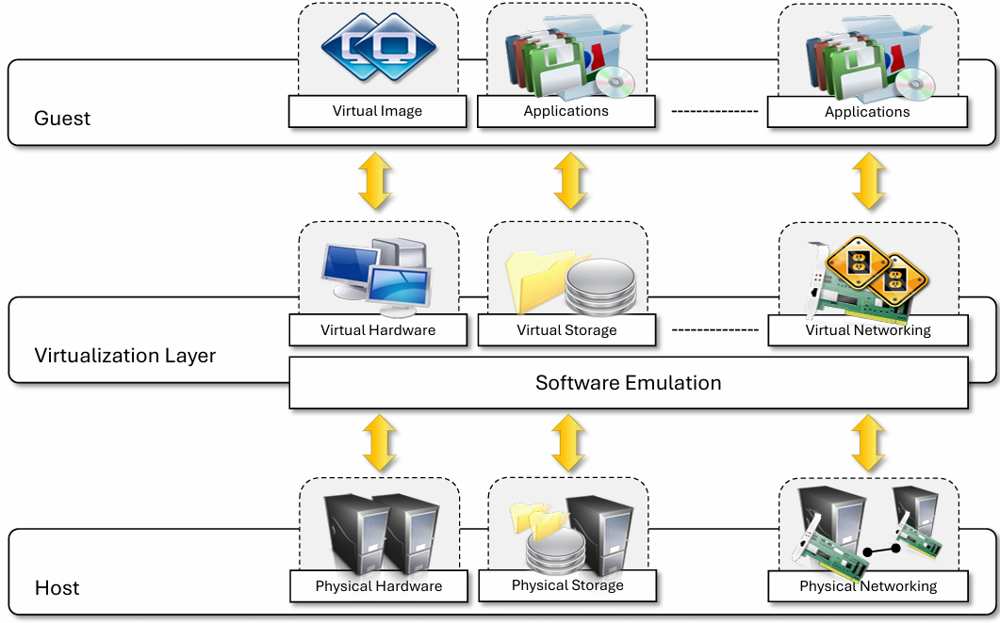
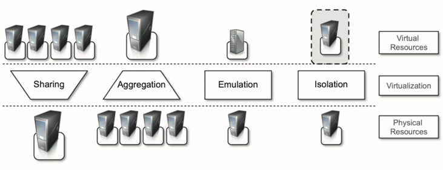
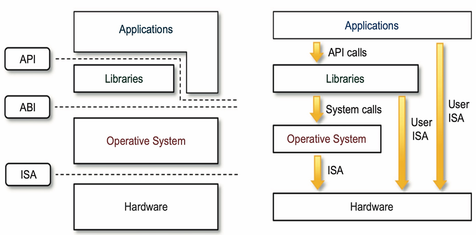
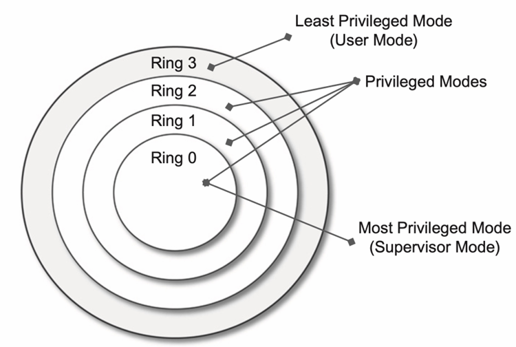
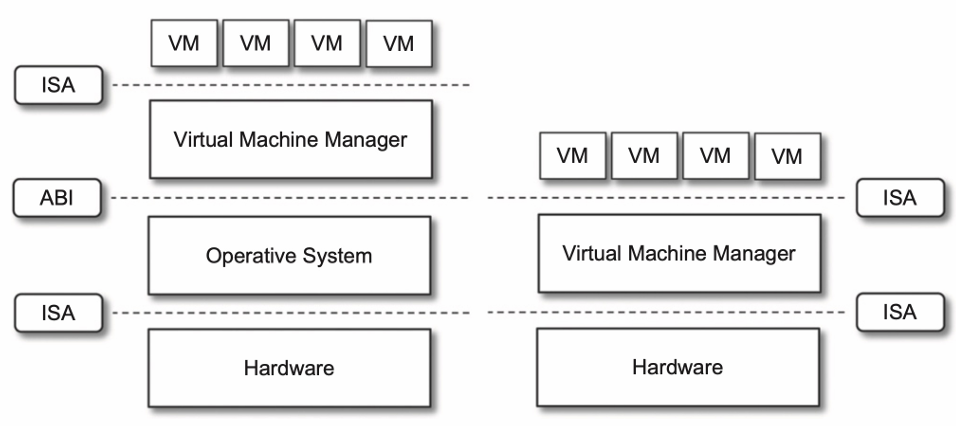
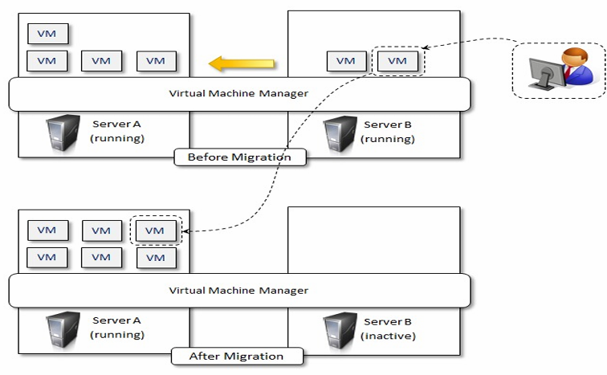

# Virtual Machine

## 1 - Virtualization
Virtualization: a broad concept in providing an abstract environment — virtual hardware or an operating system (os: software) for running applications. 

Virtualization is often synonymous with hardware virtualization, which is fundamental in efficiently delivering 
**Infrastructure as a Service (IaaS) solutions** for cloud computing.

Virtualization provides a virtual environment for not only executing applications but also for **storage**, **memory**, and 
**networking**.

*Necessity of Virtualization: Make applications compatible across different devices and environment.

## 2 - Virtual Environment (what virtualization techs provide)

### 2.1 Characteristics
1. Guest: represents the system component that interacts with the virtualization layer rather than with the host.
2. Host: represents the **original environment** where the guest is supposed to be managed.
3. Virtualization Layer: is responsible for **recreating** the same or a different environment where the guest will operate.

### 2.2 - Cloud Virtualization Reference Model

### 2.3 - Increased security
1. The ability to **control the execution of a guest** in a completely **transparent manner** opens new possibilities for 
delivering a **secure, controlled execution environment**.
2. This level of indirection allows the virtual machine manager to control and filter the activity of the guest, thus
**preventing some harmful operations** from being performed.
3. Resources exposed by the host can then be **hidden** or simply **protected** from the guest.
### 2.4 - Managed execution
1. Sharing: virtualization allows the creation of a separate computing environment within the same host. In this way,
it's possible to fully exploit the capabilities of a powerful host, which would otherwise be underutilized.
2. Aggregation: not only is it possible to share physical resources among several guests, but virtualization also allows
aggregation, which is the opposite process. A group of separate hosts can be tied together and be represented to guests as
a single virtual host.
as a single virtual host.
3. Emulation: guest programs are executed within an environment that is controlled by the virtualization layer, which ultimately is a program.
4. Isolation: virtualization allows providing guests - whether they are operating systems, applications, or other entities - 
with a completely separate environment, in which they are executed.

## 3 - Virtualization System Model

At the bottom layer, the model for the **hardware** is expressed in terms of the **Instruction Set Architecture (ISA)**, which
defines the instruction set for the processor, registers, memory, and interrupt management.

ISA is the interface between hardware and software, and it is important to the OS developer (System ISA) and developers 
of applications that directly manage the underlying hardware (User ISA).

The **Application Binary Interface (ABI)** separates the operating system layer from the applications and libraries, which are
managed by the OS. **ABI covers details such as low-level data types, alignment, and call conventions** and defines a format for executable programs.
**System calls** are defined at this level. This interface allows portability of applications anf libraries across operating systems
that implement the same ABI.

The highest level of abstraction is represented by the Application Programming Interface (API), which interfaces applications
to libraries and/or the underlying operating system.

#### Security rings and Privilege Modes
The instruction set exposed by the hardware has been divided into different security classes that define who can operate
with them.
- Non-privileged instructions: those instructions that can be used **without interfering with other tasks** because
they do not access shared resources, for instance, all the floating, fixed-point, and arithmetic instructions.
- Privileged instructions: those instructions that are executed under **specific restrictions** and are mostly used for 
**sensitive operations**, which expose (behavior-sensitive) or modify (control-sensitive) the privileged state.
For example, behavior-sensitive instructions are those that operate on the I/O, whereas control-sensitive instructions
alter the state of the CPU registers.

## 4 - Implementing Virtualization
Virtualization has come into many flavors by providing 
virtual environments at different level.
### 4.1 - Hardware Level Virtualization

A fundamental element of hardware virtualization is the **hypervisor**, or virtual machine manager (VMM). It recreates
a hardware environment in which guest operating system are installed. There are two major types of hypervisor:
Type I and Type II.
- Type I hypervisor **run directly on top of the hardware**. Therefore, they take the place of the operating systems 
and interact directly with the ISA interface exposed by the underlying hardware. They emulate this interface to allow
the management of guest operating systems. 
- Type II hypervisors **require the support of an operating system** to provide virtualization services. This means that
they are programs managed by the operating systems, which interact with it through the ABI and emulate the ISA of virtual
hardware for guest operating systems.

 
Three main modules of a VMM:
1. Dispatcher: the entry point of the monitor.
2. Allocator: deciding the system resources to be provided.
3. Interpreter: executes a privileged instruction.

### 4.2 - Operating System Level Virtualization
Operating system level virtualization offers the opportunity to create different and **separated execution environment**
for applications that are managed concurrently.

Differently from hardware virtualization, there is no virtual machine manager or hypervisor, and the virtualization is
done within a single operating system, where the OS kernel allows for multiple isolated users - space instances.

### 4.3 - Programming Language Level Virtualization
Programming language level virtualization is mostly used to achieve **ease of deployment** of applications, **managed execution**,
and **portability** across different platforms and operating systems.

It consists of a **virtual machine** executing the byte code of a program, which is the result of the compilation process.

Examples: Java platform & .NET Framework

### 4.4 - Application Level Virtualization
Application level virtualization is a technique allowing **applications to be run in the runtime environment** that do not
natively support all the features required by such applications. In this scenario, applications are **not installed** in
the expected runtime environment but are run as though they were.

Example: Wine - which is a software application allowing Unix-like OSs to execute programs written for the Microsoft
Windows platform.

## 5 - Advantages of VMs
- Run program when the needed physical hardware is not available,
- Easier to create new machines, backup machines, etc.,
- Software testing using “clean” installs of operating systems and software,
- Emulate more machines than are physically available,
- Timeshare lightly loaded systems on one host,
- Debug problems (suspend and resume the problem machine),
- Virtualization abstracts the underlying resources;
- isolates users from one another; 
- simplifies using resources;

## 6 - More Features
#### server consolidation
Hardware and programming language virtualization are the techniques adopted in cloud computing systems:
- Hardware virtualization is an enabling factor for solutions in the Infrastructure-as-a-Service (IaaS) market segment.
- Programming language virtualization is a technology leveraged in Platform-as-a-Service (PaaS) offerings.

This opportunity is particularly attractive when resources are underutilized because it allows for the reduction of the 
number of active resources by aggregating virtual machines over a smaller number of resources that become fully utilized.
This practice is also known as server consolidation.

#### VM Migration
The movement of virtual machine instances is called **virtual machine migration**. 
Because vm instances are controllable environments, consolidation can be applied with a minimum impact, either by 
**temporarily stopping its execution** and **moving its data** to the new resources or by performing a finer control and moving
the instance while it is running. This second techniques is known as **live migration** and in general is more complex to
implement but more efficient since there is no disruption of the activity of the vm instance.

## 7 - Pros & Cons of Cloud Virtualization

### 7.1 - Advantages of Cloud Virtualization
- Managed execution and isolation
- Portability, especially for execution virtualization techniques
- Portability and self-containment also contribute to reduce the costs for maintenance.
- Efficient use of resources. Multiple systems can securely coexist and share the resources of the underlying host, 
without interfering with each other.

### 7.2 - Disadvantages of Cloud Virtualization
- Performance Degradation
- Inefficiency and Degraded User Experience
- Security Holes and New Threats (phishing, malicious programs which are designed to extract from the guest sensitive 
information)

