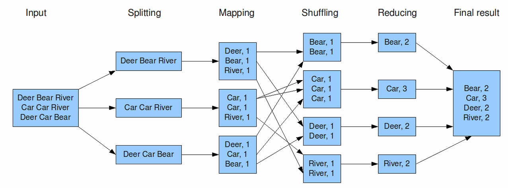
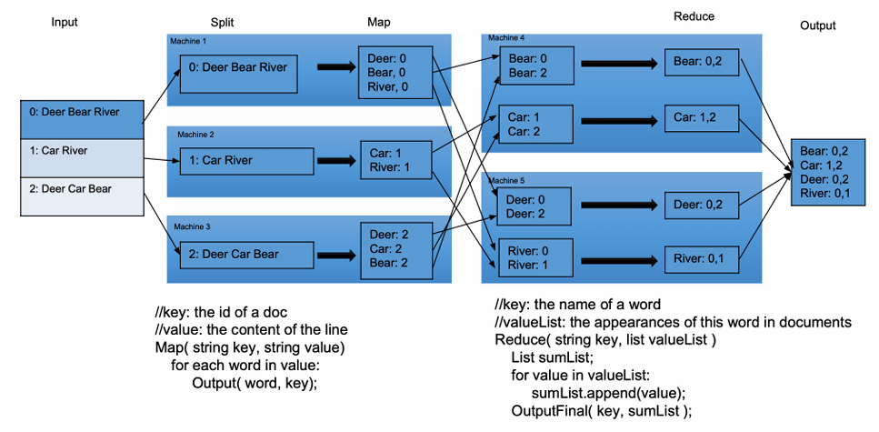
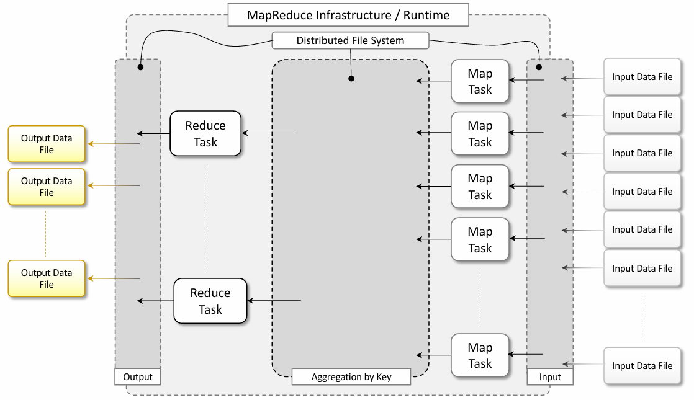
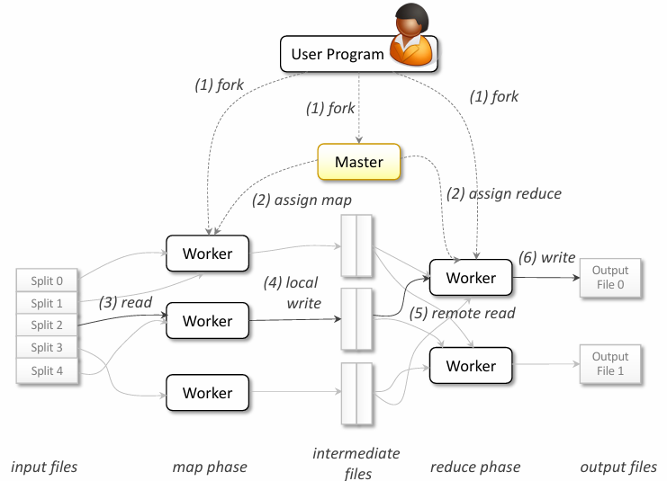

# Map Reduce

## 1 - Data-Intensive Computing
Large volumes of data need to be efficiently **stored**, made **accessible**, **indexed**, and **analyzed** in many fields like social
networking.

**Distributed computing** can help address challenges generated during performing these tasks by providing more scalable
and efficient storage architectures and better data computation and processing performance. 

### 1.1 What's Data-Intensive Computing 
Data-intensive computing is concerned with the **production**, **manipulation**, and **analysis** 
of **large-scale data**, ranging from hundreds of megabytes (MB) to petabytes (PB) and beyond.

### Applications
1. Computational science
2. Bioinformatics applications
3. Earthquake simulators
4. Social networking
5. Gaming

### Characteristics of Data-Intensive Applications
- Handle multiple terabytes to petabytes of data
- Utilize **multi-step analytical pipelines** (**transformation**, **fusion**).
- Require efficient **data management**, **filtering**, **querying**, and **distribution**.

## 2 - Challenges and Advancements

### 2.1 - Challenges
The huge amount of data produced, analyzed, or stored imposes requirements on the 
**supporting infrastructures** and **middleware** that are hardly found in the **traditional 
solutions** for distributed computing. For example, the **location of data** is crucial, as moving terabytes of data becomes an 
obstacle to high-performing computations.


### 2.2 - Advancement
Data partitioning, as well as content replication and scalable algorithms help improve the 
performance of data-intensive applications. 
1. **Scalable algorithms** for searching and processing large datasets.
2. New **metadata management technologies** that can scale to handle complex, heterogeneous, and distributed data sources.
3. **High-performance computing platforms** supporting access to multi-terabyte in-memory data structures.
4. Reliable petascale **distributed file systems**.
5. **Data signature generation techniques** for **data reduction** and rapid processing.

### 2.3 - New Approaches
- Software mobility to move computations to data locations.
- Hybrid interconnection architectures for efficient data stream filtering.
- High-performance software integration for building analytical pipelines.


## 3 - Introducing the MapReduce Programming Platform

### 2.1 - Programming Platforms
Platforms for programming data-intensive applications provide **abstractions** that help **express computation** over a large
quantity of information and runtime systems that can efficiently manage huge volumes of data.

Traditionally, database management systems based on the relational model have been 
used to express the **structure and the connections between the entities** of a data model. This approach has proven to 
be **ineffective** in the case of “Big Data,” where information is 
mostly **unstructured or semi-structured** and where data is most likely to be organized in 
large files or a huge number of medium-sized files rather than rows in a database.


### 2.2 - The MapReduce Programming Model
MapReduce is a programming platform introduced by Google to **process large quantities of data**. 
It expresses the computation logic of an application into two simple functions: **map** and **reduce**.
- **Map function**: Processes input key-value pairs to produce intermediate key-value pairs.
- **Reduce Function**: Aggregates intermediate key-value pairs to generate final results.
The computation of MapReduce applications is then organized in a **workflow of the 
map and reduce operations** that are entirely controlled by the runtime system.

### 2.3 - Map & Reduce
More precisely, the model is expressed in the form of two functions, which are defined as follows:
- _map(k1,v1)_ -> _list(k2,v2)_, the map function read a **key-value pair** and produce a **list of different types of 
key-value pairs**.
- _reduce(k2, list(v2))_ -> _list(v2)_, the reduce function **reads a pair** composed of a key and a list of values
and **produces a list of values of the same type**.

### 2.4 - MapReduce Computation
In general, any computation that can be expressed in the form of two major stages 
can be represented in MapReduce computation. These stages are:
1. **Analysis**: This phase operates directly to the data input file and corresponds to the 
operation **performed by the map task**. Moreover, the computation at this stage is 
expected to be embarrassingly parallel since map tasks are executed without any 
sequencing or ordering.
2. **Aggregation**. This phase operates on the intermediate results and is characterized by 
operations aimed at aggregating, summing, and/or elaborating the data obtained at 
the previous stage to present it in its final form. **The reduce function** performs this 
task.

## 3 - MapReduce Example - Word Count
How to count the word frequency of a web page?

Solution 1: For loop, iterate each row and use hash map `HashMap<String, Integer> wordcount = new HashMap<String, Integer>();`:
```
// for each word
wordcount[word]++
```

Solution 2: Using multiple machines


### Best Solution: Map Reduce


*Using inverted index can improve performance


**Data transfer and management** are completely **handled by the distributed storage 
infrastructure** (i.e., the Google File System), which provides access to data, replicates 
files, and eventually moves them where needed.

Therefore, developers no longer have to handle these issues. They are provided with an 
**interface that presents data at a higher level** as a **collection of key-value pairs**.

Developers have only to specify **how the map and reduce functions operate** on the key
value pairs.

## 4 - MapReduce Computational Workflow
1. Splitting: Data is divided into manageable splits for processing.
2. Mapping: Each split is processed to generate intermediate key-value pairs.
3. Shuffling: Intermediate pairs are grouped by key.
4. Reducing: Aggregated pairs are reduced to produce the final output.



The output of **map tasks** is **aggregated** by grouping the values according to their corresponding keys 
and **constitutes the input of reduce tasks**, which reduce the list of attached values to a **single value** 
for each of the keys found. 

## 5 - Google MapReduce Infrastructure Overview



This model has proven successful in Google, where most of the information that needs to 
be processed is stored in **textual form** and represented by **web pages or log files**. The 
following are some examples that show the flexibility of MapReduce.
- Distributed Grep: Searches for patterns in text files.
- URL-Access Frequency: Analyzes web server logs to count URL accesses.
- Reverse Web-Link Graph: The Reverse web-link graph **keeps track of all the possible web pages 
that might lead to a given link**. In this case, **input files are simple HTML pages scanned by map** 
tasks **emitting _<target, source>_ pairs** for each of the links found given in the web page source. The 
**reduce task will collate all the pairs with the same target into a <target, list(source)> pair**. The final 
result is given one or more files containing these mappings.
- Term-Vector per Host: Summarizes important words in documents by host.

