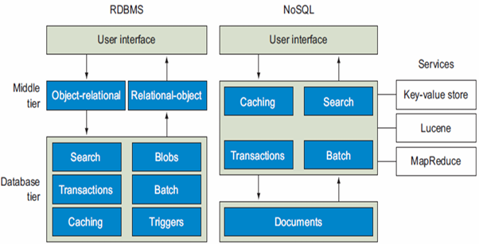

# Big Table
This lecture covers the principles and design considerations of BigTable, a distributed storage system developed by Google. 
It addresses the limitations of traditional file systems, the benefits of database systems, and the specific mechanisms 
BigTable employs to achieve efficiency, scalability, and reliability.
## 1 - File System
Traditional file systems offer basic operations such as "read" and "write". However, they struggle with more complex 
operations like querying specific data or calculating aggregates.
- Pros: provide basic operations like "read" and "write".
- Cons: Can’t support well more complicated operations such as:
  - Check the score of Joe
  - Check all records where the score is less than 90
  - Check the average score

## 2 - Database Systems
To overcome the limitations of file systems, database systems are built **on top of** them. These systems **manage data
storage** more efficiently and **provide interfaces for complex operations**.
Key Points:
- Management: Organizes data for efficient storage and retrieval.
- Interfaces: Supports complex queries and transactions.

## 3 - Designing a Database System
A well-designed database system integrates with the file system but optimizes for performance and complexity. 
For example, to store and retrieve key-value pairs (e.g., Joe: 42), the design must ensure efficient access and update mechanisms.

Considerations:
- Input/Output: Mapping keys to values.
- Storage: Utilizing the file system while optimizing data access patterns.

## 4 - Improving Search Operations
- In-Memory Operations: Load files to memory for faster access.
- Sorting: Maintain sorted data for efficient searching (binary search).

## 5 - Transaction Concept
Transactions are fundamental in ensuring data integrity and consistency. 
They are **atomic units of operation that must be executed fully or not at all**.

### 5.1 - ACID Requirements
- Atomicity: Ensures complete execution or rollback (the system should ensure that updates of a partially executed transaction are not reflected in 
the database).
- Consistency: 
  - Explicitly specified integrity constraints such as primary keys and foreign keys
  - Implicit integrity constraints (e.g. sum of balances of all accounts, minus sum of loan amounts must 
equal value of cash-in-hand)
- Isolation: Prevents interference from concurrent transactions (running transactions serially can simply ensure isolation).
- Durability: once the user has been notified that the transaction has completed the updates to the 
database by the transaction must persist even if there are software or hardware failures.

### 5.2 Example
Transaction to transfer $50 from account A to account B
1. read(A)
2. A := A - 50
3. write(B)
4. read(B)
5. B := B + 50
6. write(B)

## 6 - Transaction Processing
Online Transaction Processing (OLTP) systems, crucial for cloud applications, require 
1. **short response times**: Minimize delays
2. **scalability**: Handle increasing loads efficiently 
   1. Vertical scaling: Data and workload are distributed to systems that share resources, 
   e.g., cores/processors, disks, and possibly RAM 
   2. Horizontal scaling: The systems do not share either primary or secondary storage.

Transaction overhead comes from several sources, each contributing to processing delays.
1. Logging: Ensures durability by recording changes (11.9%).
2. Locking: Maintains atomicity by preventing concurrent access (16.2%).
3. Latching: Coordinates access to shared resources (14.2%).
4. Buffer Management: Manages data in memory and disk (34.6%).

## 7 - BASE Model
BASE (Basically Available, Soft state, Eventually consistent) offers an alternative to ACID, focusing on availability and
eventual consistency, suitable for many NoSQL systems.

1. Basic Availability: Ensures availability even during failures.
2. Soft State: Allows temporary inconsistencies.
3. Eventual Consistency: Guarantees consistency over time.

The number-one objective is to **allow new data to be stored**, even at the risk of 
being out of sync for a short period of time. They relax the rules and allow 
reports to run even if not all portions of the database are synchronized.

BASE systems tend to be **simpler** and **faster** because they don’t have to write 
code that deals with locking and unlocking resources. 

Their mission is to **keep the process moving** and **deal with broken parts at a later 
time**.

BASE systems are ideal for **web storefronts**, where filling a shopping cart and 
placing an order is the main priority.

## ACID VS BASE
- ACID: used in Relational Database Management System (RDBMS) - focus on consistency
- BASE: used in NoSQL systems - focus on availability

## 8 - CAP Theorem
The CAP theorem states that a distributed system can only provide two out of the three: Consistency, Availability, and Partition Tolerance.
1. Consistency - Having a **single**, **up-to-date**, readable version of your data available to all clients. 
This isn’t the same as the consistency we talked about in ACID. Consistency here is concerned 
with **multiple clients reading the same items from replicated partitions and getting consistent 
results**.
2. High availability — Knowing that the distributed database will always allow database clients to 
update items without delay. Internal communication failures between replicated data shouldn’t 
prevent updates.
3. Partition tolerance—The ability of the system to keep responding to client requests even if there’s a communication 
4. failure between database partitions.

## 9 - NoSQL Databases

NoSQL systems prioritize scalability and availability, often at the expense of immediate consistency. Yet, they ensure
that data will **be eventually consistent** at some future point in time, instead of enforcing consistency at the time 
when a transaction is **committed**.

Attributes:
1. Scalability: efficiently handle large volumes of data.
2. Resilience: no single point of failure.
3. Consensus: have built-in support for consensus-based decisions.

## 10 - BigTable: Read and Write Operations
BigTable employs strategies like "append" for writes and binary search for reads. Data is periodically sorted to maintain
efficiency.

- Append: Efficiently add new data.
- Binary Search: Quick retrieval from sorted data.
- K-way Merge Sort: Periodic sorting of data chunks.

## 11. Power Failures and Write Ahead Log (WAL)
WAL ensures data integrity by recording changes before they are applied, allowing quick recovery after failures.

Mechanism:

Pre-write Logging: Records changes for recovery.
## 12. Optimizing Read Operations
BigTable uses indexes and bloom filters to enhance read efficiency, reducing the need to scan entire datasets.

Optimizations:

Indexes: Quick access to data locations.
Bloom Filters: Probabilistic structures to check data existence.
15. Scaling BigTable
Scaling involves strategies like sharding (partitioning data) and consistent hashing to distribute data across multiple machines.

Methods:

Sharding: Distributes data across nodes.
Consistent Hashing: Balances load without frequent rebalancing.
## 13. Handling Concurrent Access
To manage concurrent read/write operations, distributed locks (e.g., Chubby, Zookeeper) are used, ensuring data integrity.

Solution:

Distributed Locks: Prevent simultaneous conflicting operations.
## 14. Summary of Write and Read Operations
BigTable’s architecture supports efficient write and read operations, maintaining data integrity and performance across distributed systems.

