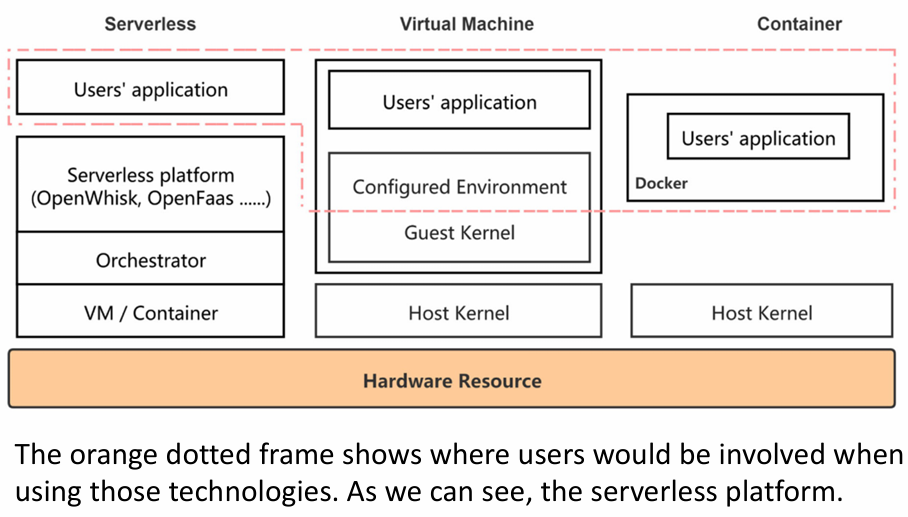

# Serverless Computing

## 1 - Motivation
Traditional Infrastructure-as-a-Service (IaaS) models require **long-term server** allocations, leading to **low resource
utilization** (about 10% on average). This inefficiency has driven the development of **platform-managed, on-demand services**,
known as serverless computing, which offer higher resource utilization and lower costs. Major cloud vendors such as 
Amazon, Google, Microsoft, IBM, and Alibaba provide these services.

## 2 - Introduction
Serverless computing reduces the granularity of computing to the **function level**, **simplifying** management for developers.
Developers only need to write **cloud functions in high-level languages** (e.g., Java, Python), 
**set several simple parameters**, and **upload** these functions to a serverless platform. Then, 
they could use the **returned API or HTTP requests** to execute their well-defined computation tasks.
Serverless computing leaves the **management and scheduling issues to the platform**.

Besides, serverless providers always deploy application-dependent services, also known as 
**Backend as a Service (BaaS)**, for their customers, such as **Database** and **Object Storage Services (OSS)**.
 

### Evolution of Computation Virtualization
Three Stages:
1. Virtual machines: characterized by **multiple operating systems** spinning up on **one host machine** with the aid of
**emulation or hypervisor** to support higher isolation and better hardware resource utilization. However, this technology
incurs **high memory overhead**, which in turn compromises the overall system performance. 
2. Containers: popularized by Docker (os-level virtualization), which leverages the **sharing kernel** to **increase deployment speed and portability** while 
**lowering costs**. The container **decreases the size** of the virtualization unit and **resource occupancy**.
3. **Serverless Computing**: serves as the **interaction medium** between the application and the underlying 
infrastructure, simplifying application development by sheltering resource management for developers.

## 3 - Definition
**Serverless Computing = FaaS(Function-as-a-Service) + BaaS(Backend-as-a-Service)**. One 
**fallacy** is that Serverless is interchangeable with FaaS. To be precise, they both are essential 
to serverless computing. The FaaS model enables **function isolation** and invocation, whereas 
**Backend-as-a-Service (BaaS) provides overall backend support** for online services. 

In the FaaS model (aka the Lambda paradigm), an application is **sliced into functions** or 
**function-level microservices**. The function identifier, the language runtime, the memory limit 
of one instance, and the function code blob URI (Uniform Resource Identifier) together 
define the existence of a function. 

The **BaaS covers a wide range** of services that any application relies on and can be 
categorized into it—for example, the **cloud storage** (Amazon S3 and DynamoDB), the 
**message bus system** for passing (Google Cloud pub/sub), the **message notification service** 
(Amazon SNS), and **DevOps tools** (Microsoft Azure DevOps).

A serverless platform serves as the **interaction medium** between the application and the 
underlying infrastructure, simplifying application development by sheltering resource 
management for developers. 

Consequently, no server can be observed from the user perspective, even though serverless 
platforms still rely on servers to set up the basic runtime environment. 

## 4 - Characteristics

### 4.1 - Autoscaling
Serverless systems **scale horizontally and vertically** with workload demands, including **scaling to zero instances**. 
Cold startups, **instances start from scratch, initialize the software environment, and load application-specific code**,
can slow response times, challenging service quality.

### 4.2 - Flexible Scheduling
Applications are **dynamically scheduled** across clusters and regions to balance load and ensure performance by serverless
controller. Serverless platforms are hostless and elastic, reducing user overhead for server management and upgrades.

### 4.3 - Event-Driven
Serverless applications are **triggered by events** like **HTTP queries** or message queue updates. 

### 4.4 - Transparent Development
Developers are abstracted from underlying resource management, which is handled by the cloud vendor. 
This includes **isolated sandboxes, reliable execution environments, and available physical nodes**.

### 4.5 - Pay-As-You-Go
Costs shift **from capital expenses to operating expenses**, with billing based on actual resource usage, regardless of 
whether instances are running or idle, **eliminates the requirement for users to buy exclusive servers** based on the peak load.

### 4.6 - Function Programming & Function Serving
Function Programming: Programmers develop their functions by following the rules provided by 
platform providers in the local environment. After that, they deploy the functions to the platform 
using the command line where the platform first saves these functions in a database and pushes the 
runtimes of these functions into a repository, then it returns the URLs of these functions to the 
programmers. 

Function Serving: Once a user wants to invoke a function, he/she could use its returned URL or a 
configured triggering event to invoke the function through an API gateway provided by the platform. 
The load balancer or the scheduler of the platform then fetches the function from a database and 
prepares a running environment, called sandbox, by obtaining the function’s runtime from a remote 
repository. After these preparations, the platform can initialize the application-specific environment 
(e.g., loading class files), and then execute the function. the serverless model is attractive in terms 
of reduced burdens in managing servers, automatic scaling, pay-for-use pricing, and event-driven 
streaming.

### 4.7 - Statelessness
A stateful application could remember at least something about its state each time that it runs, so 
it requires persistent storage to store its states.
 
However, serverless functions usually **run in a stateless container** hosted by the serverless 
platform, which only lives for a short period without saving ephemeral state information in its persistent storage.

In this way, the **scale-out of the platform** is relatively easy as the users could merely spin up more instances. 

### 4.8 - Short But Variable Execution Times
Functions execute for milliseconds to minutes, with billing in millisecond granularity. AWS Lambda, for example, 
limits execution to 15 minutes.

### 4.9 - Poor Intra-Function Parallelism
Parallelizing within single function instances can reduce communication and synchronization overhead compared to
inter-function parallelization.

### 4.10 - 

## 5 - Applications

