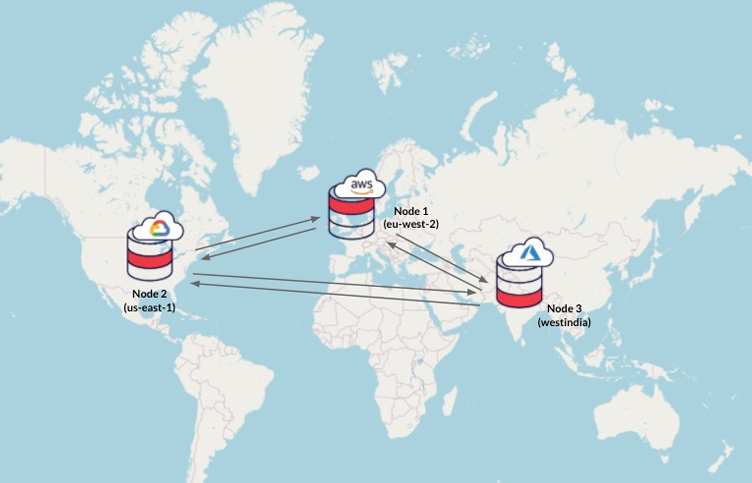

# Obstacles & Opportunities

## 1 - Service Availability & Business Continuity
User Expectation: The availability should be as high as a search engine homepage (24h/7d).

### 1.1 - Obstacles
A single point of failure (a part of a system that, if it fails, will stop the entire system from working)
significantly jeopardizes the service availability of a cloud service. This risk is particularly pronounced when only one
company manages the entire cloud computing service. Even if the company
has multiple data centers in **different geographic regions** using different network providers, it may have **common software
infrastructure** and accounting systems or even out of business.

Aside of technical issues, a cloud provider could suffer outages for **non-technical reasons**, including going out of 
business or being the target of regulatory action.

### 1.2 - Opportunity
The best chance for independent software stacks is for them to be provided by **different companies**, as it has been 
difficult for one company to justify creating and maintaining two stacks in terms of software dependability.

Like large Internet service providers use multiple network providers so that failure by a single company will not take
them off the air, we believe the only plausible solution to very high availability is **multiple cloud computing providers**.

## 2 - Data Lock-In
### 2.1 - The Obstacle
Since the storage API for cloud computing are still essentially proprietary, indicating each cloud computing service has
its unique storage api and methods, concerns about the difficulty of extracting
data from the cloud is preventing some organizations from adopting cloud computing. Data lock-in may make users vulnerable to
price increases, reliability problems.

### 2.2 - The Solution
**Standardize the APIs** so that a SaaS developer can deploy services and data across multiple cloud computing providers 
so that the failure of a single company does not take all copies of customer data with it.

-> this might lead to a "race-to-the-bottom" of cloud pricing and flatten cloud computing profits:
- increases **the quality of services**
- enables a new usage model, in which the same software infrastructure can be used in an internal data center (private cloud) and a public
cloud.

## 3 - Data Confidentiality / Auditability
Security is one of the most often-cited objections to cloud computing. 

### 3.1 The Obstacle
The cloud users needs to protect themselves from another user or the provider.
The provider also needs protection against users to attack one another or the underlying cloud infrastructure.

### 3.2 The Solution / Opportunity
- The cloud user is responsible for **application-level** security.
- The cloud provider is responsible for **physical security** and likely for enforcing **external firewall policies**. 
- Security for **intermediate software stack layers** is shared between the user and the operator.
The primary security mechanism in today's cloud is **virtualization**.

## 4 - Data Transfer Bottlenecks

### 4.1 - The Obstacle
As applications grow more data-intensive, the high costs associated with massive data transportation have emerged as a significant issue.
### 4.2 - The Solutions
- Ship disks
- Distribute data on multi-clouds:

    

## 5 - Performance Unpredictability
### 5.1 - The Obstacle
Although VMs can surprisingly share CPUs and main memory well in cloud computing, but network and disk I/O sharing is 
more problematic.
### 5.2 - The Opportunity
1. Improve architectures and operating systems to virtualize interrupts and I/O channels efficiently.
2. Flash memory (faster access less energy) will decrease I/O interference.

### 5.3 Another Obstacle
The **scheduling of VMs** for come classes of batch processing programs, specifically for high-performance computing.
- HPC applications need to ensure that all the threads of a program are running simultaneously, which is easy to realize
in local pc, while today's VMs and OSs do not provide a programmer-visible way to ensure this.
### 5.4 The Solution
Offer "gang scheduling" for cloud computing - gang scheduling is a scheduling algorithm for parallel systems that schedules 
related threads or processes to run simultaneously on different processors.
## 6 - Scalable Storage

### 6.1 - The Obstacle

### 6.2 - The Opportunity

## 7 - Bugs in Large Distributed Systems

### 7.1 - The Obstacle
These bugs cannot be reproduced in smaller configurations, so the debugging must occur at scale in the production
data centers.
### 7.2 - The Opportunity
The reliance on virtual machines in cloud computing.

## 8 - Scaling Quickly
Pay-as-you-go applies to **storage** and **network bandwidth**, which count bytes used. Computation is slightly different,
depending on the virtualization level.
### 8.1 - The Obstacle

### 8.2 - The Opportunity

## 9 - Reputation Fate Sharing

### 9.1 - The Obstacle
One customer's bad behavior can affect the reputation of others using the same cloud.
### 9.2 - The Opportunity
- create **reputation-guarding services** similar to the “trusted email” services currently offered (for a fee) to 
services hosted on smaller ISP’s, which experience a microcosm of this problem. Cloud computing providers would want **customers to be liable** and not them (such as, the company sending the 
spam should be held liable, not Amazon).

## 10 - Software Licensing

### 10.1 - The Obstacle
Many cloud computing providers originally relied on open source software in part because the 
licensing model for commercial software (**not** open) is not a good match to utility computing. 
### 10.2 - The Opportunity
Either for open source to remain popular or simply for commercial software companies to 
change their licensing structure to better fit cloud computing (e.g., pay-as-you-go software licensing). 

## Summary
- The first three affect adoption:
- The next five affect growth.
- The last two are policy and business obstacles.

| Obstacle                            | Opportunity                                                     |
|-------------------------------------|-----------------------------------------------------------------|
| 1. Availability/Business Continuity | Use Multiple Cloud Providers                                    |
| 2. Data Lock-In                     | Standardize APIs; Compatible SW to enable Surge or Hybrid Cloud Computing |
| 3. Data Confidentiality and Auditability | Deploy Encryption, VLANs, Firewalls                             |
| 4. Data Transfer Bottlenecks        | FedExing Disks; Higher BW Switches                              |
| 5. Performance Unpredictability     | Improved VM Support; Flash Memory; Gang Schedule VMs            |
| 6. Scalable Storage                 | Invent Scalable Store                                           |
| 7. Bugs in Large Distributed Systems | Invent Debugger that relies on Distributed VMs                  |
| 8. Scaling Quickly                  | Invent Auto-Scaler that relies on ML; Snapshots for Conservation|
| 9. Reputation Fate Sharing          | Offer reputation-guarding services like those for email         |
| 10. Software Licensing               | Pay-for-use licenses                                            |
