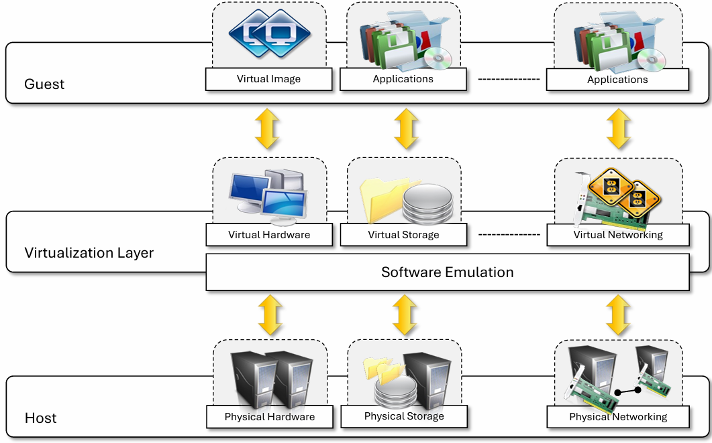
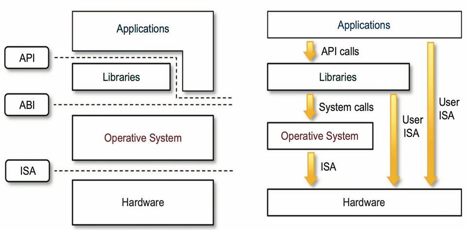

# Virtual Machine

## 1 - Virtualization
Virtualization: a broad concept in providing an abstract environment — virtual hardware or an operating system (os: software) for running applications. 

Virtualization is often synonymous with hardware virtualization, which is fundamental in efficiently delivering **IaaS solutions** 
for cloud computing.

Virtualization provides a virtual environment for not only executing applications but also for **storage**, **memory**, and 
**networking**.

*Necessity of Virtualization: Make applications compatible across different devices and environment.

## 2 - Virtual Environment (what virtualization techs provide)

### 2.1 Characteristics
1. Guest: represents the system component that interacts with the virtualization layer rather than with the host.
2. Host: represents the **original environment** where the guest is supposed to be managed.
3. Virtualization Layer: is responsible for **recreating** the same or a different environment where the guest will operate.

### 2.2 - Cloud Virtualization Reference Model

### 2.3 - Increased security
1. The ability to **control the execution of a guest** in a completely **transparent manner** opens new possibilities for 
delivering a **secure, controlled execution environment**.
2. This level of indirection allows the virtual machine manager to control and filter the activity of the guest, thus
**preventing some harmful operations** from being performed.
3. Resources exposed by the host can then be **hidden** or simply **protected** from the guest.
### 2.4 - Managed execution
1. Sharing: virtualization allows the creation of a separate computing environment within the same host. In this way,
it's possible to fully exploit the capabilities of a powerful host, which would otherwise be underutilized.
2. Aggregation: not only is it possible to share physical resources among several guests, but virtualization also allows
aggregation, which is the opposite process. A group of separate hosts can be tied together and be represented to guests as
a single virtual host.
as a single virtual host.
3. Emulation: guest programs are executed within an environment that is controlled by the virtualization layer, which ultimately is a program.
4. Isolation: virtualization allows providing guests - whether they are operating systems, applications, or other entities - 
with a completely separate environment, in which they are executed.

## 3 - Virtualization System Model

At the bottom layer, the model for the **hardware** is expressed in terms of the **Instruction Set Architecture (ISA)**, which
defines the instruction set for the processor, registers, memory, and interrupt management.

ISA is the interface between hardware and software, and it is important to the OS developer (System ISA) and developers 
of applications that directly manage the underlying hardware (User ISA).

The **Application Binary Interface (ABI)** separates the operating system layer from the applications and libraries, which are
managed by the OS. **ABI covers details such as low-level data types, alignment, and call conventions** and defines a format for executable programs.
**System calls** are defined at this level. This interface allows portability of applications anf libraries across operating systems
that implement the same ABI.

The highest level of abstraction is represented by the Application Programming Interface (API)

## 4 - Implementing Virtualization

## 5 - Cloud Virtualization

## 6 - Pros & Cons of Cloud Virtualization

